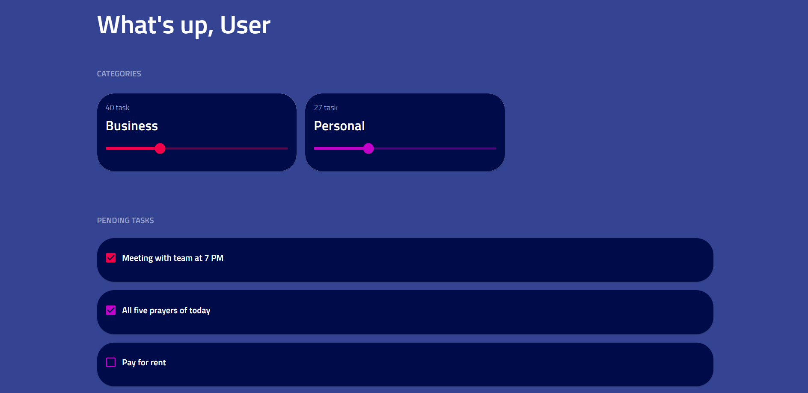
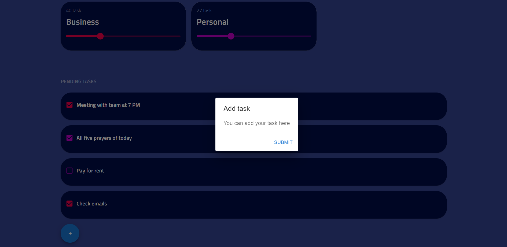
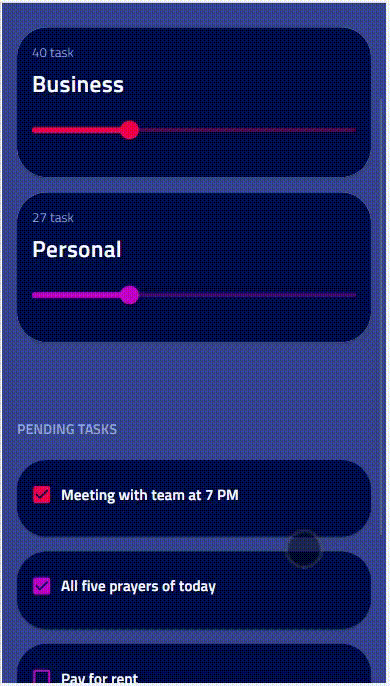

# Todo (Landing page) 

A Webapp build using React and Material UI  
Design inspiration for your react todo app 

Design features :
1. Add task category wise
2. Get to know the status of remaining task in each category
3. Mark tasks as completed.

### App homepage

### Add new task

### Mobile responsive

  

